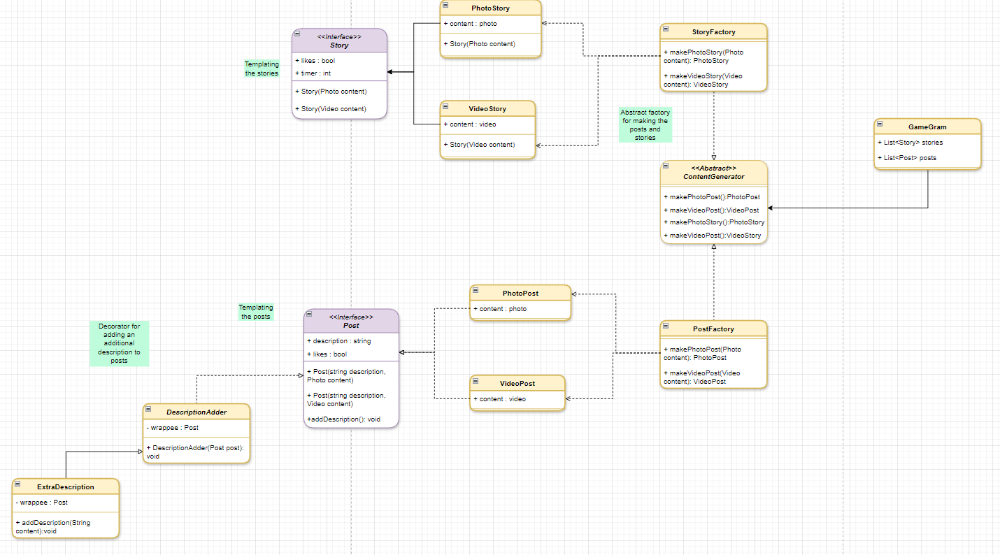

# GameGram
### Description
GameGram is an application that mimics Instagram but focusing on gaming. The application will feature the ability to:
- Create Posts
- Edit Posts
- Create a Moment (Equivalent of an Instagram Story)
- Publish Videos or Photos within the posts or moments
- Use filters on photos before publishing

## Problem Description
Social media has a focus of having as many users as possible to use its services. However this lacks specificity and this is what GameGram is meant to address. GameGram is dedicated for specifically gaming and gaming related things, whether it be photos or videos. The point of GameGram is to allow people to share their gaming or gaming related content with each other.
## MoSCoW Analysis
| MoSCoW | Description | 
| --- | --- | 
| Must | - The application must work   - The application must have a User Interface.   - The application must make use of at least 3 design patterns.   - The app must have posts and moments working correctly. |
| Should | - A pleasant looking User Interface   - The application should have uniform styling. |
| Could | - Photos having redirect links that can be accessed when clicked.   - Emoji overlay for photos (An emoji displayed over the image).   - Text overlay on the photo's.   - User profile.   - Stories could have optional audio playback of their own songs that they like. | 
| Won't | - There won't be search navigation for searching for posts.   - There will not be user accounts   - No native photo or video taking capabilities.   No direct messaging (No users) |

## Design Patterns 
- Template
- Decorator (Wrapper)
- Abstract Factory

## Pattern Implementation
| Pattern | How it's used |
| --- | --- | 
| Decorator | Posts will have an optional description. If a post has an existing description and a user wants to modify it, we all the user to make another description below the initial one. This is done for tracking of changes purposes. | 
| Template | Posts will have a standardised template for how a post should look like. |
| Abstract Factory | The abstract factory is responsible for creating the different filters for **photos** in the posts and moments. |

## Class Diagram

